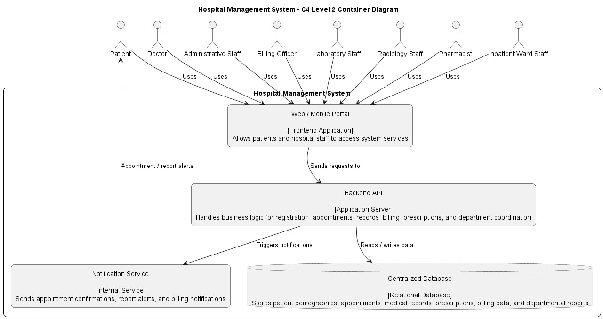
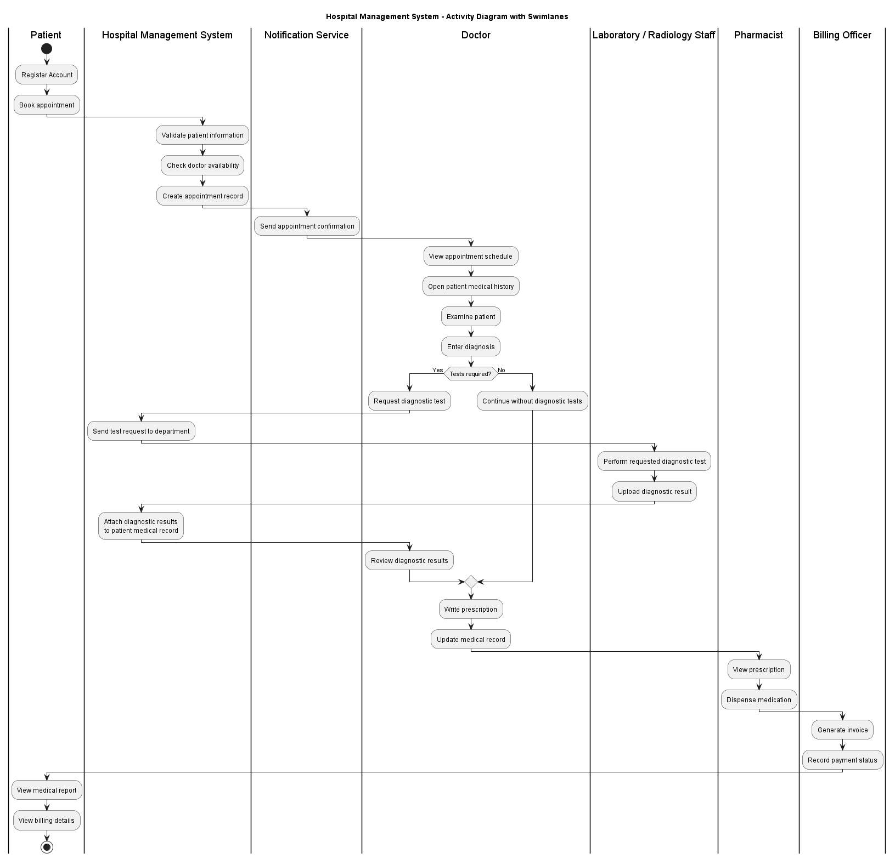
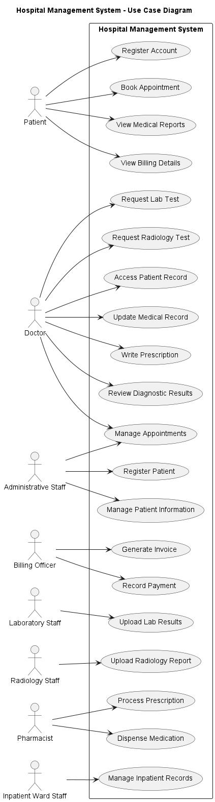
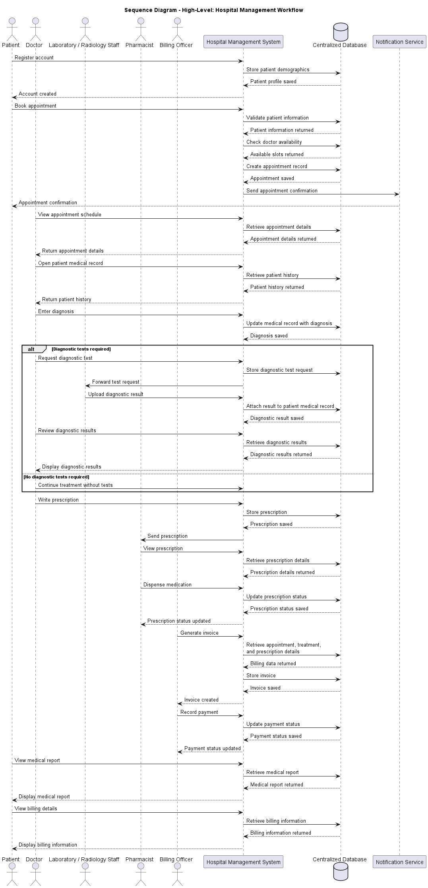
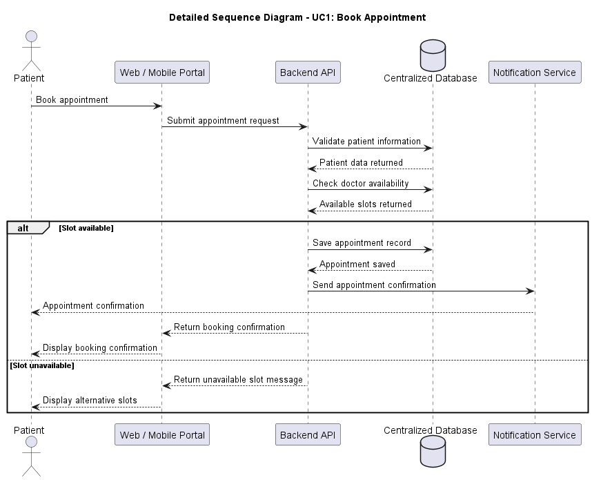
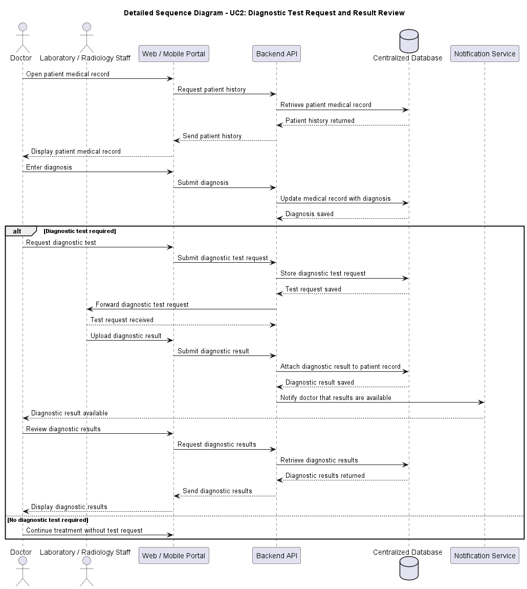
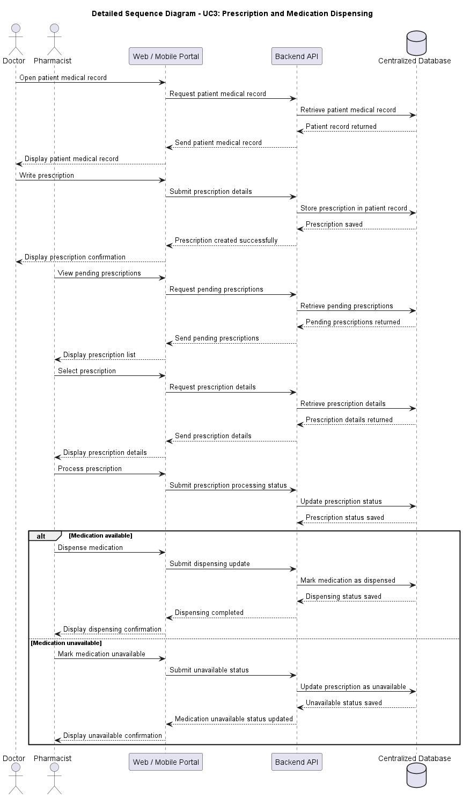
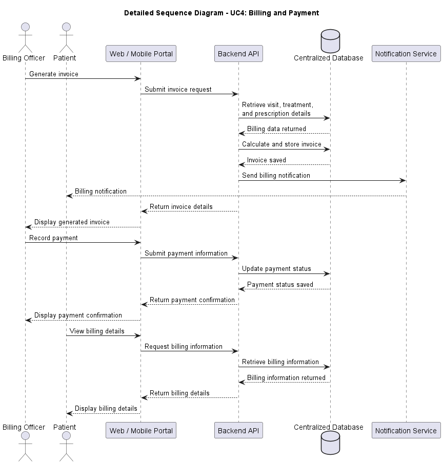
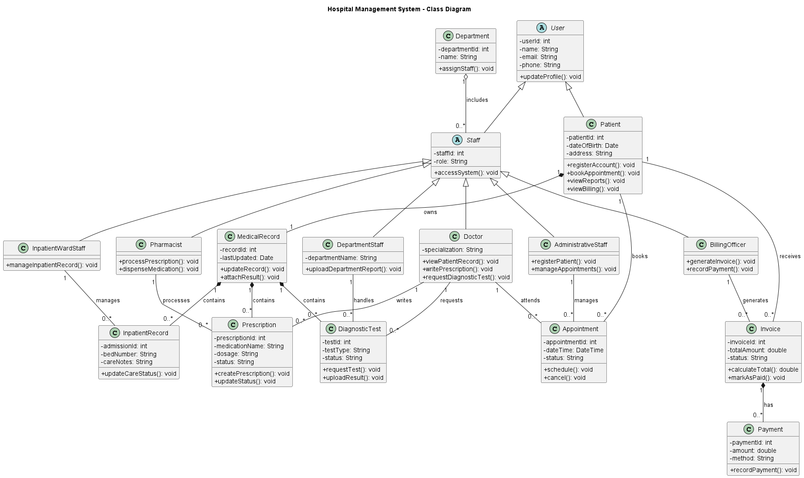
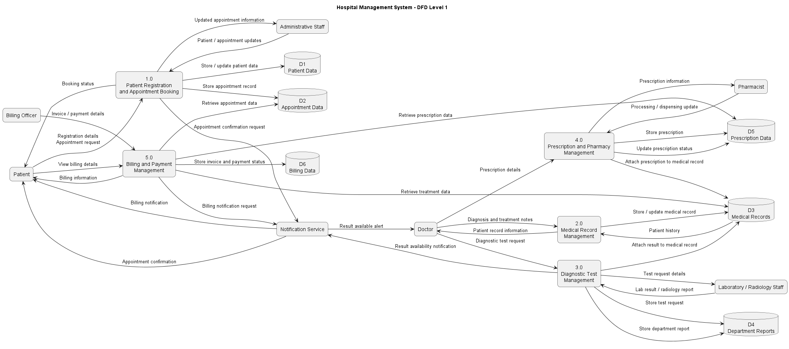

# Group08 - Hospital Management System

## 1. Group Info

**Group Number:** Group08  
**Case Study:** Hospital Management System  
**Course:** Software Engineering  
**Instructor:** Dr. Samer Elkababji

### Group Members

| Name | Student ID |
|---|---|
| Hamza Bodair | 20210449 |
| Nazeeh AlHanbali | 20210114 |
| Hamza Abu-Sair | 20210185 |
| Abdalrahman Abu Zahra | 20210833 |

---

## 2. Overview

The Hospital Management System is a comprehensive information system designed to streamline hospital operations. The system supports patient registration, appointment scheduling, billing, medical record management, prescriptions, laboratory results, radiology reports, pharmacy services, inpatient ward records, and coordination between hospital departments.

The purpose of the system is to improve communication between patients, doctors, administrative staff, laboratory/radiology staff, pharmacists, inpatient ward staff, and billing officers through a centralized digital platform.

**Tools Used:**

| Tool | Purpose |
|---|---|
| Visual Studio Code | Writing and organizing project files |
| PlantUML | Creating UML, C4-style, and DFD diagrams |
| GitHub | Version control and team collaboration |
| Markdown | Writing README and report content |
| Pandoc | Converting Markdown report to PDF |

---

## 3. Diagrams

| Diagram | Description | Status |
|---|---|---|
| C4 Level 1 Context Diagram | Shows the Hospital Management System as one complete system and identifies the external users who interact with it. | **Done** |
| C4 Level 2 Container Diagram | Shows the main internal containers: web/mobile portal, backend API, centralized database, and notification service. | **Done** |
| Activity Diagram with Swimlanes | Shows the workflow of appointment booking, examination, diagnostic testing, prescription, billing, and patient report access. | **Done** |
| Use Case Diagram | Shows the main functions provided by the system and the actors who use them. | **Done** |
| Use Case Descriptions | Describes the four selected use cases: appointment booking, diagnostic tests, prescription dispensing, and billing/payment. | **Done** |
| High-Level Sequence Diagram | Shows stakeholder-level interactions across the main hospital workflow. | **Done** |
| Detailed Sequence Diagrams | Shows developer-level interactions for UC1, UC2, UC3, and UC4 using portal, backend API, database, and notification service. | **Done** |
| Class Diagram | Shows the main system classes, attributes, operations, inheritance, aggregation, composition, and associations. | **Done** |
| DFD Level 1 | Shows the main data flows between actors, processes, centralized database, and notification service. | **Done** |

---

## 4. Repo Structure

| Folder / File | Explanation |
|---|---|
| `/docs` | Contains the project report files, including Markdown and PDF versions. |
| `/uml` | Contains the final PlantUML source files and exported diagram images used in the report. |
| `/out/uml` | Contains generated PlantUML output images before copying them to the final UML folder. |
| `README.md` | Contains project information, diagram list, tools, and team contributions. |

---

## 5. Contributions

| Member Name | Role / Contribution | Number of Commits |
|---|---|---|
| Hamza Bodair | Created context diagram, container diagram, DFD, and repository setup | 22 |
| Hamza Abu-Sair | Created activity diagram and use case diagram | 2 |
| Abdalrahman Abu Zahra | Created sequence diagrams and use case descriptions | 2 |
| Nazeeh AlHanbali | Prepared class diagram, report explanations, and final formatting | 3 |

\newpage

# System Description

## 1. Introduction

The Hospital Management System is a centralized information system designed to support and organize the main operations of a hospital. The system helps manage patient registration, appointment scheduling, medical records, prescriptions, diagnostic results, billing, and inpatient ward information. It also supports coordination between several hospital departments, including laboratory, radiology, pharmacy, billing, and inpatient wards.

The main purpose of the system is to reduce manual work, improve communication between hospital staff, and provide patients with easier access to appointments, reports, and billing information. Instead of keeping patient data in separate paper files or disconnected systems, the Hospital Management System stores important information in a centralized database that can be accessed by authorized users.

## 2. Main Actors

The system includes several actors who interact with it based on their roles.

**Patient:**  
The patient can register an account, book appointments, view medical reports, and view billing details.

**Doctor:**  
The doctor can view appointment schedules, access patient medical records, enter diagnoses, request diagnostic tests, review lab or radiology results, and write prescriptions.

**Administrative Staff:**  
Administrative staff can register patients, manage patient information, and manage appointments.

**Laboratory / Radiology Staff:**  
Laboratory and radiology staff receive diagnostic test requests, perform the required tests, and upload results or reports to the system.

**Pharmacist:**  
The pharmacist views prescriptions, processes them, and records medication dispensing status.

**Billing Officer:**  
The billing officer generates invoices and records payment information.

**Inpatient Ward Staff:**  
Inpatient ward staff manage admitted patient records, care notes, and inpatient information.

**Notification Service:**  
The notification service sends appointment confirmations, billing notifications, and diagnostic result alerts.

## 3. System Modules

The Hospital Management System is divided into several main modules.

### Patient Registration and Appointment Module

This module allows patients to register and book appointments with doctors. The system validates patient information, checks doctor availability, saves appointment records, and sends confirmation notifications.

### Medical Record Management Module

This module allows doctors to access and update patient medical records. It stores diagnosis notes, treatment information, prescriptions, diagnostic results, and inpatient notes.

### Diagnostic Test Management Module

This module supports lab and radiology workflows. Doctors can request tests, the system forwards the request to the correct department, and lab/radiology staff upload the results. The results are attached to the patient medical record.

### Prescription and Pharmacy Module

This module allows doctors to write prescriptions and pharmacists to process and dispense medications. Prescription status is updated in the centralized database.

### Billing and Payment Module

This module allows billing officers to generate invoices based on hospital services such as appointments, treatment, diagnostic tests, and prescriptions. It also records payments and allows patients to view billing details.

### Inpatient Ward Module

This module supports admitted patient management. Ward staff can update inpatient records, bed information, and care notes. These records are linked to the patient medical record.

## 4. Centralized Database

The centralized database is an important part of the system. It stores patient demographics, appointments, medical records, diagnostic results, prescriptions, billing information, payments, department reports, and inpatient records. This allows different departments to access updated information from one shared source.

## 5. Selected Use Cases

Although the full system includes many functions, four major use cases were selected for detailed sequence modeling:

1. Book Appointment  
2. Diagnostic Test Request and Result Review  
3. Prescription and Medication Dispensing  
4. Billing and Payment  

Other functions such as patient registration and inpatient ward management are included in the overall system scope but are not selected as detailed sequence diagrams.

\newpage

# C4, UML, and DFD Diagrams

## 1. C4 Level 1 Context Diagram

### Explanation

The C4 Level 1 Context Diagram shows the Hospital Management System as one complete system. It identifies the main external users who interact with the system, including patients, doctors, administrative staff, billing officers, laboratory staff, radiology staff, pharmacists, and inpatient ward staff. The diagram also shows how each actor uses the system for registration, appointments, records, prescriptions, diagnostic results, billing, and inpatient care.

---

## 2. C4 Level 2 Container Diagram

### Explanation

The C4 Level 2 Container Diagram shows the internal structure of the Hospital Management System. It includes the Web/Mobile Portal, Backend API, Centralized Database, and Notification Service. Users access the system through the portal. The portal sends requests to the backend API, which handles business logic and reads or writes data to the centralized database. The notification service sends alerts such as appointment confirmations, report alerts, and billing notifications.

---

## 3. Activity Diagram with Swimlanes

### Explanation

The activity diagram shows the main hospital workflow using swimlanes. The process starts when the patient registers and books an appointment. The system validates the patient information, checks doctor availability, and creates an appointment record. The doctor then views the appointment, opens the patient medical history, examines the patient, and enters a diagnosis. If tests are required, lab or radiology staff perform the test and upload the result. The doctor writes a prescription, the pharmacist dispenses medication, the billing officer generates an invoice, and the patient views the report and billing details.

---

## 4. Use Case Diagram

### Explanation

The use case diagram shows the main functions provided by the Hospital Management System and the actors who use them. Patients can register, book appointments, view medical reports, and view billing details. Doctors can access patient records, update medical records, write prescriptions, request tests, and review diagnostic results. Administrative staff manage appointments and patient information. Laboratory and radiology staff upload reports, pharmacists process prescriptions, billing officers generate invoices and record payments, and inpatient ward staff manage inpatient records.

---

## 5. Use Case Descriptions

The following tables describe the four major use cases selected for detailed sequence modeling.

### UC1: Book Appointment

| Field | Description |
|---|---|
| Use Case Name | Book Appointment |
| Primary Actor | Patient |
| Goal | Allow a patient to book an appointment with a doctor through the hospital system. |
| Preconditions | Patient is registered/authenticated. Doctor schedule exists in the system. |
| Main Flow | 1. Patient selects the book appointment option. 2. Patient enters appointment details such as doctor/specialty, date, and time. 3. System validates patient information. 4. System checks doctor availability. 5. System saves the appointment record. 6. System sends an appointment confirmation notification. 7. Patient receives booking confirmation. |
| Alternative Flow | If the selected slot is unavailable, the system displays alternative available slots and asks the patient to choose another time. |
| Postcondition | Appointment is saved in the centralized database and confirmation is sent to the patient. |

### UC2: Diagnostic Test Request and Result Review

| Field | Description |
|---|---|
| Use Case Name | Diagnostic Test Request and Result Review |
| Primary Actor | Doctor |
| Supporting Actors | Laboratory Staff / Radiology Staff |
| Goal | Allow the doctor to request diagnostic tests and review uploaded lab or radiology results. |
| Preconditions | Patient medical record exists. Doctor is authorized to access the patient record. |
| Main Flow | 1. Doctor opens the patient medical record. 2. System retrieves and displays the patient record. 3. Doctor requests a diagnostic test. 4. System saves the test request. 5. System forwards the request to laboratory or radiology staff. 6. Laboratory/radiology staff uploads the diagnostic result. 7. System saves the result in the patient medical record. 8. System notifies the doctor that results are available. 9. Doctor reviews the diagnostic results. |
| Alternative Flow | If diagnostic results are not uploaded yet, the system displays the test status as pending. |
| Postcondition | Diagnostic results are stored in the patient medical record and become available for doctor review. |

### UC3: Prescription and Medication Dispensing

| Field | Description |
|---|---|
| Use Case Name | Prescription and Medication Dispensing |
| Primary Actor | Doctor |
| Supporting Actor | Pharmacist |
| Goal | Allow the doctor to write a prescription and allow the pharmacist to process and dispense medication. |
| Preconditions | Patient has been examined. Patient medical record exists. |
| Main Flow | 1. Doctor writes a prescription through the system. 2. System saves the prescription in the patient record. 3. Pharmacist views the prescription. 4. System retrieves prescription details. 5. Pharmacist processes the prescription. 6. System updates the prescription status. 7. Pharmacist dispenses the medication. 8. System records the dispensing status. |
| Alternative Flow | If medication is unavailable, the pharmacist updates the prescription status as unavailable. |
| Postcondition | Prescription and dispensing status are updated in the centralized database. |

### UC4: Billing and Payment

| Field | Description |
|---|---|
| Use Case Name | Billing and Payment |
| Primary Actor | Billing Officer |
| Supporting Actor | Patient |
| Goal | Allow the billing officer to generate invoices and record payments, and allow the patient to view billing details. |
| Preconditions | Patient has received hospital services such as appointment, treatment, test, or prescription. |
| Main Flow | 1. Billing officer generates an invoice. 2. System retrieves billing data from the centralized database. 3. System saves the invoice. 4. System sends a billing notification to the patient. 5. Billing officer records payment details. 6. System updates payment status. 7. Patient views billing details through the portal. 8. System displays invoice and payment information. |
| Alternative Flow | If payment is partial, the system records the payment as partially paid. If no billing record exists, the system displays that no billing information is available. |
| Postcondition | Invoice and payment status are saved in the centralized database and can be viewed by the patient. |

---

## 6. High-Level Sequence Diagram

### Explanation

The high-level sequence diagram shows the complete hospital workflow from a stakeholder perspective. It starts with patient registration and appointment booking, then continues with doctor examination, medical record access, diagnostic tests, prescriptions, pharmacy processing, billing, payment, and patient report access. This diagram focuses on the interaction between actors and the Hospital Management System without showing detailed internal components.

---

## 7. Detailed Sequence Diagram - UC1: Book Appointment

### Explanation

This sequence diagram shows how a patient books an appointment through the Web/Mobile Portal. The portal sends the appointment request to the Backend API. The API validates the patient, checks doctor availability, saves the appointment if a slot is available, and triggers the notification service. If the slot is unavailable, the system displays alternative available slots.

---

## 8. Detailed Sequence Diagram - UC2: Diagnostic Test Request and Result Review

### Explanation

This sequence diagram shows how a doctor requests a diagnostic test and reviews the result. The doctor opens the patient record, submits a test request, and the system forwards it to laboratory or radiology staff. After the result is uploaded, it is saved in the centralized database and the doctor receives a result availability notification.

---

## 9. Detailed Sequence Diagram - UC3: Prescription and Medication Dispensing

### Explanation

This sequence diagram shows how prescriptions are created and processed. The doctor writes the prescription through the portal, and the Backend API stores it in the centralized database. The pharmacist then views the prescription, processes it, dispenses the medication, and updates the prescription status.

---

## 10. Detailed Sequence Diagram - UC4: Billing and Payment

### Explanation

This sequence diagram shows how billing and payment are handled. The billing officer generates an invoice, and the system retrieves the required billing data from the centralized database. The invoice is saved, and the patient receives a billing notification. The billing officer records payment details, and the patient can view billing information through the portal.

---

## 11. Class Diagram

### Explanation

The class diagram shows the main classes of the Hospital Management System. It includes user-related classes such as Patient and Staff, with specialized staff classes such as Doctor, AdministrativeStaff, BillingOfficer, LaboratoryRadiologyStaff, Pharmacist, and InpatientWardStaff. It also includes important system entities such as Appointment, MedicalRecord, DiagnosticTest, Prescription, Invoice, Payment, InpatientRecord, and Department.

The diagram uses inheritance to show that Patient and Staff are types of User. It also uses associations to show relationships such as patients booking appointments, doctors writing prescriptions, pharmacists processing prescriptions, and billing officers generating invoices. Composition is used for strong ownership, such as a patient owning medical records and an invoice containing payments. Aggregation is used to show that a department can include staff members.

---

## 12. DFD Level 1

### Explanation

The DFD Level 1 diagram shows the main data flows in the Hospital Management System. It includes the main external entities, system processes, centralized database, and notification service. The system processes include registration and appointments, medical records, diagnostic tests, prescriptions and pharmacy, billing and payment, and inpatient ward management. The centralized database stores all major system data, including patient information, appointments, medical records, reports, prescriptions, billing, and inpatient records.

\newpage

# Overall Diagram Alignment

All diagrams are aligned with the case study. The C4 diagrams define the system scope and internal containers. The use case diagram and descriptions identify the major actors and system functions. The activity diagram shows the main workflow from appointment booking to billing and report access. The sequence diagrams provide both a high-level workflow and detailed developer-level interactions for the four selected use cases. The class diagram shows the structural design of the system, while the DFD Level 1 shows the major data flows.

The system consistently uses a centralized database, which matches the case study requirement. The diagrams also include the main hospital departments mentioned in the case study, including laboratory, radiology, pharmacy, billing, and inpatient wards.

# GitHub Repository Link

GitHub Repository: https://github.com/hamztion/Software_Project_Group8/

# Conclusion

The Hospital Management System provides a structured solution for managing hospital operations through a centralized digital platform. It supports patients, doctors, administrative staff, laboratory/radiology staff, pharmacists, billing officers, and inpatient ward staff. The system improves hospital coordination by connecting appointment booking, medical records, diagnostic results, prescriptions, billing, and inpatient records in one integrated system.

The provided C4, UML, and DFD diagrams explain the system from different viewpoints, including context, internal architecture, behavior, interactions, structure, and data flow. Together, these diagrams provide a complete and consistent software engineering design for the Hospital Management System.